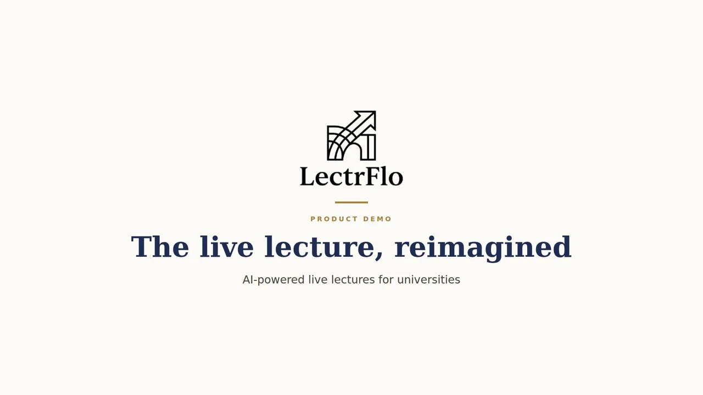
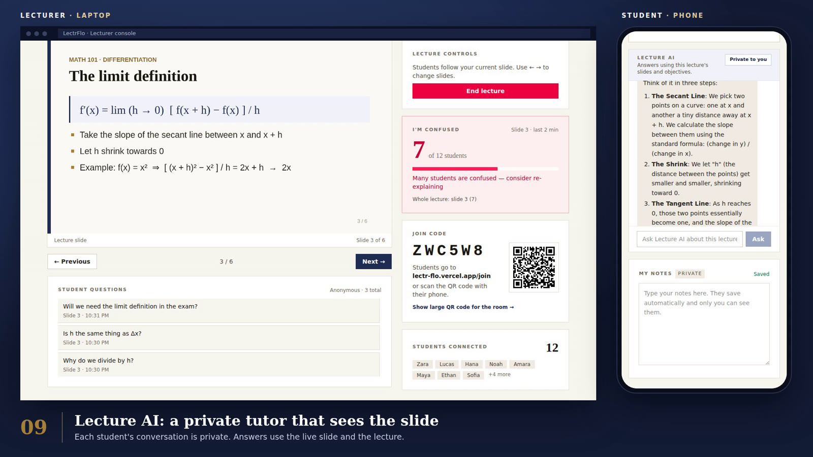
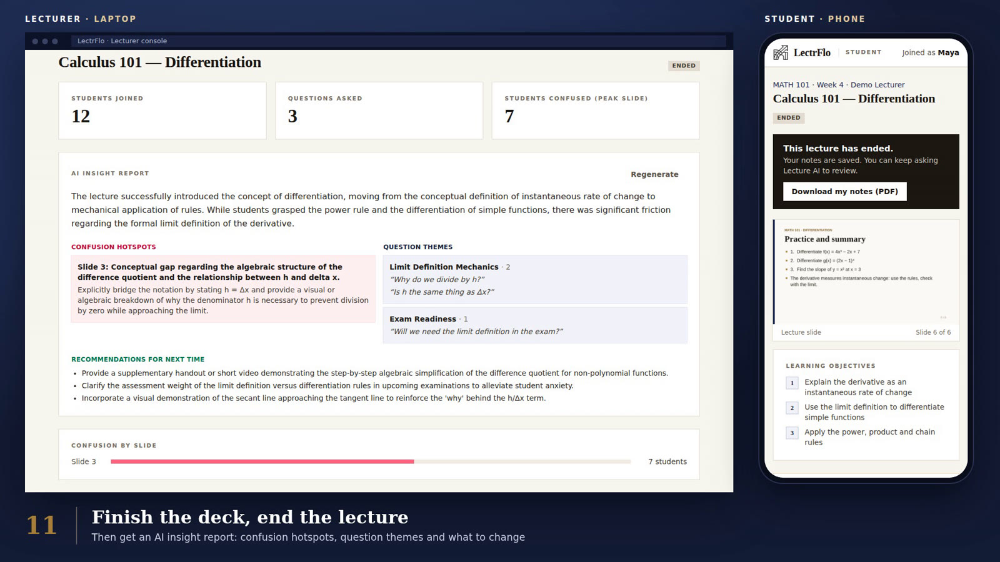
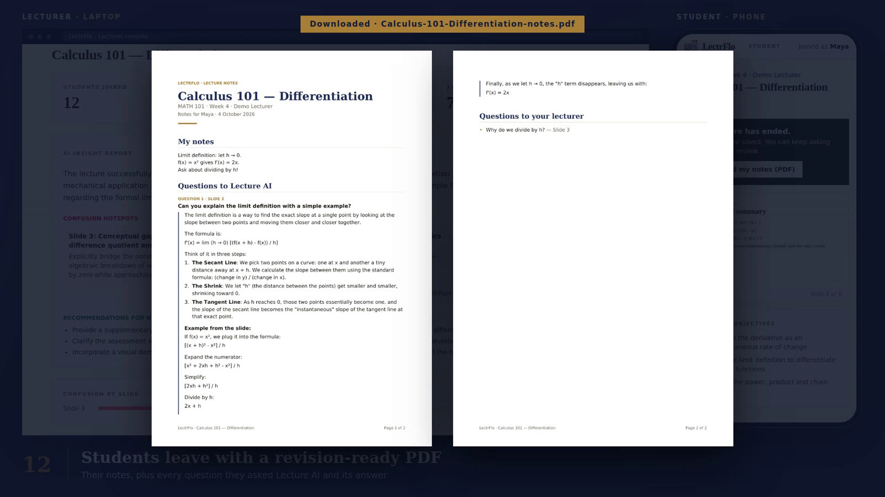
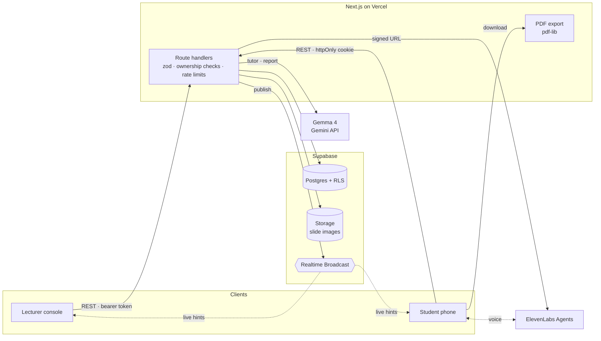

<div align="center">

<picture>
  <source media="(prefers-color-scheme: dark)" srcset="docs/images/lectrflo-logo-light.png" />
  
</picture>

# LectrFlo

**The live lecture, reimagined.** Students follow the lecture on their own phone, flag confusion
anonymously and get a private AI tutor that sees the slide on screen. Lecturers see the class
react in real time and get an AI insight report when the lecture ends.

[Live demo](https://lectr-flo.vercel.app) · [Demo video](docs/media/LectrFlo-demo.mp4) · [Architecture](docs/ARCHITECTURE.md) · [API](docs/API.md) · [Database](docs/DATABASE.md)


-4285F4?logo=google&logoColor=white)




<sub>The full 2½-minute demo plays above on a loop. Prefer full resolution? <a href="docs/media/LectrFlo-demo.mp4">Download the 1080p video</a>.</sub>

</div>

## The problem

In a lecture hall, the students who are lost are the least likely to put their hand up. The
lecturer finds out at the exam, and students revise from patchy notes with no one to ask.

## What LectrFlo does

**For students** (no app install, no account: a join code and a name)

- Follow the lecturer's slides live on any phone or laptop.
- Tap **I'm confused**. The lecturer sees an anonymous count for the current slide, never who.
- Send **anonymous questions** to the lecturer.
- Ask **Lecture AI**, a private tutor that answers from the slide on screen and the lecture content.
- Talk it through with the **voice tutor**, which can mark you confused, ask the lecturer or save a
  note for you (optional, needs an ElevenLabs agent).
- Take private notes that save as you type, then **download a PDF** with the notes plus every
  question asked to Lecture AI and its answer.

**For lecturers**

- Start from a one-click demo lecture (the API also accepts your own slide images and text), then
  open a lobby with a **join code and QR code** to project.
- Present from the console. Every student's screen follows the slide **in real time**.
- Watch students arrive, a live **confusion meter** ("Many students are confused, consider
  re-explaining") and an anonymous **question feed**.
- End the lecture to get an **AI insight report** (confusion hotspots with likely causes, question
  themes and recommendations for next time) alongside class stats and a confusion-by-slide chart.



<table>
  <tr>
    <td></td>
    <td></td>
  </tr>
  <tr>
    <td align="center"><sub>AI insight report after the lecture</sub></td>
    <td align="center"><sub>The student's revision-ready PDF</sub></td>
  </tr>
</table>

## How the AI works

| Feature | What it does | How it stays grounded |
| --- | --- | --- |
| **Lecture AI tutor** | Answers each student privately during and after the lecture | Each answer gets the current slide image, the text of the slides revealed so far (never the ones still to come) and the learning objectives |
| **Voice tutor** (agent with tools) | Spoken conversation through ElevenLabs Agents. It can mark the student as confused, ask the lecturer, save a note and read the current slide | The tools run in the browser through the same student API as the buttons, so the same permission checks and rate limits apply |
| **Insight report** | Turns anonymous confusion signals and questions into hotspots, themes and next steps | Structured JSON output, saved as pending / complete / failed so a slow or failed run never blocks the page |

## Engineering highlights

**Privacy and security by design**
- The browser never writes to the database. Every mutation goes through a Next.js route handler
  that validates input with zod and checks ownership (`requireOwnedLecture` / `requireParticipant`).
- Row Level Security is enabled on every table, and the anon role can read nothing.
- Students are anonymous per-lecture sessions: an httpOnly cookie, with only a SHA-256 hash of the
  token stored. Composite foreign keys stop a student's notes, annotations, questions, confusion
  signals and AI messages from pointing at another lecture.
- Slides live in a private Storage bucket and are served through short-lived signed URLs.
- The ElevenLabs API key never reaches the browser. The server hands out a short-lived signed URL.

**Real time without trusting the client**
- Supabase Realtime Broadcast on a public lecture channel, plus a lecturer-only channel whose key
  only the owning lecturer receives.
- Events on the public channel are only hints to refetch. REST endpoints stay the source of truth,
  so a forged broadcast there can't change the slide or lecture state anyone sees, and pages fall
  back to polling.

**AI that fails gracefully**
- One provider module wraps the Gemini API (Gemma 4) with JSON mode, a time budget that fits
  Vercel's 60-second limit, and a fallback for models without "thinking" support.
- Without an API key the AI endpoints return `503 ai_unavailable` and the rest of the app keeps
  working. A stalled report is taken over after two minutes instead of spinning forever.
- Rate limits: one confusion signal per 30 seconds, 5 questions a minute, 10 AI messages per
  5 minutes.

**Server-side PDF generation**
- Built with pdf-lib and embedded, subset DejaVu fonts, so maths symbols (′ ∘ ⁿ → √) and accented
  names print correctly.
- A custom layout engine wraps text in linear time (a pathological 100,000-character note went from
  several minutes to about a second), keeps headings with their content and dates the lecture in
  the student's time zone.

**Operational polish**
- `/api/health` reports configuration, database reads and writes, tables and the storage bucket,
  so a broken deployment explains itself.
- The database migration is safe to re-run and ends with a self-check query.

## Architecture



| Layer | Technology |
| --- | --- |
| Frontend | Next.js 16 App Router, React 19, TypeScript (strict), Tailwind CSS 4 |
| Backend | Next.js route handlers, zod validation, Node.js runtime on Vercel |
| Data | Supabase Postgres with RLS, Storage, Realtime Broadcast, anonymous auth |
| AI | Gemma 4 (`gemma-4-26b-a4b-it`) via the Gemini API, ElevenLabs Agents (`@elevenlabs/react`) |
| Documents | pdf-lib with `@pdf-lib/fontkit`, DejaVu fonts |
| Quality | Vitest, ESLint, end-to-end API smoke test against local Supabase with a mock AI server |

More detail: [Architecture](docs/ARCHITECTURE.md) · [API contract](docs/API.md) · [Database and access model](docs/DATABASE.md)

## Project structure

```
src/
  app/                      pages (/, /join, /lecture/[id], /lecturer, /lecturer/[id]) and API routes
  components/               lecturer console panels, student panels, slide viewer, UI kit
  lib/
    ai/                     provider, prompts, report runner
    supabase/               admin, server and browser clients
    client/                 typed API clients, hooks, demo lecture builder, voice tools
    auth.ts                 requireLecturer / requireOwnedLecture / requireParticipant
    export.ts, notes-pdf.ts notes document model and PDF renderer
    lifecycle.ts, limits.ts lecture state rules and rate limits
    types.ts                shared API types (the frontend contract)
supabase/migrations/        schema, RLS policies and storage bucket
scripts/                    smoke test and mock AI server
docs/                       architecture, API and database docs
```

## Getting started

Requires Node 22.12+ and, for a local database, Docker.

```bash
npm install
npx supabase start                # local Postgres, Auth, Storage and Realtime; applies migrations
cp .env.example .env.local        # fill in from `npx supabase status -o env`
npm run dev                       # http://localhost:3000
```

Optional keys in `.env.local`:

- `GEMINI_API_KEY` turns on Lecture AI and the insight report.
- `ELEVENLABS_API_KEY` and `ELEVENLABS_AGENT_ID` turn on the voice tutor.

Without them the app runs and those features say they aren't set up.

<details>
<summary>Using a hosted Supabase project</summary>

1. Apply the schema with `npx supabase link --project-ref <ref>` and `npx supabase db push`, or
   paste all of `supabase/migrations/20261003000000_init.sql` into the SQL Editor and run it. It is
   safe to run again and ends with a check that should show `true` on every row.
2. Turn on **Authentication → Sign In / Providers → Allow anonymous sign-ins**. Lecturers use an
   anonymous session in this version, and each browser owns the lectures it creates.
3. Set `NEXT_PUBLIC_SUPABASE_URL` (project URL), `NEXT_PUBLIC_SUPABASE_ANON_KEY` (publishable or
   anon key) and `SUPABASE_SERVICE_ROLE_KEY` (secret or service-role key) in `.env.local` or your
   Vercel project.
4. Open `/api/health?write=1` on the deployed app to confirm everything is connected.

</details>

### Try the demo

1. Open `/lecturer`, click **Create demo lecture** (Calculus 101: Differentiation), then **Open lobby**.
2. On a phone, open `/join`, enter the code and a name.
3. Click **Start lecture** and move with **Next** or the arrow keys.
4. On the phone, tap **I'm confused**, ask the lecturer a question and ask Lecture AI.
5. Click **End lecture** for the AI insight report. The student can then download their notes PDF.

## Testing

```bash
npm run lint
npm run typecheck
npm test                          # Vitest unit tests (rules, validation, prompts, PDF layout, voice tools)
npm run build
node scripts/smoke-test.mjs       # end-to-end API test; needs a running app and Supabase (see the file header)
```

The smoke test drives a whole lecture through the public API: lecturer setup, students joining,
live slides, confusion, questions, Lecture AI, ending, reports and the PDF export. It checks
access rules along the way, for example that one student can't read another's notes or AI chat.

## Roadmap

- Lecturer sign-in and uploading your own slides (the API already accepts slide images and text).
- UI for AI-suggested learning objectives and the per-student recap (both exist in the API).
- Save voice tutor conversations alongside the text chat and include them in the PDF.
- Tell the insight report how far through the deck the lecture got.
- Run lint, type checks, tests and the build in CI (GitHub Actions) on every pull request.

## How it was built

LectrFlo was built for a hackathon using AI-assisted development with Claude Code, working under
the multi-agent rules in [`AGENTS.md`](AGENTS.md): one branch per piece of work and clear ownership
of shared files, migrations and API contracts. Changes were checked locally with lint, type checks,
unit tests, a production build and the end-to-end smoke test before merging.

## Credits

DejaVu fonts ([licence](assets/fonts/LICENSE-DejaVu.txt)). Built with Next.js, Supabase,
Google Gemma and ElevenLabs.
